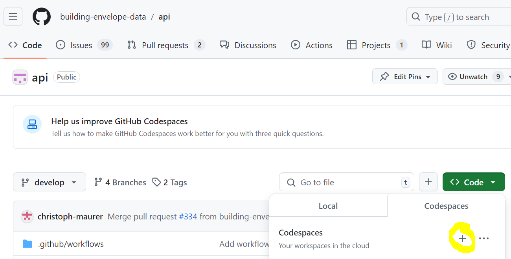

# buildingenvelopedata.org API specification

This specification of an Application Programming Interface (API) is designed to facilitate the exchange of data about building envelopes. Several [databases](https://github.com/building-envelope-data/database) use the same API specification to offer data about components. A [metabase](https://github.com/building-envelope-data/metabase) manages for example the identifiers of components and institutions which must be the same for all databases.

This API specification consists of [GraphQL](https://graphql.org) schemas to specify a GraphQL endpoint and [JSON Schemas](https://json-schema.org) to specify the format of the responses. GraphQL schemas are in the directory `./apis`. There is a [visualization of the GraphQL schema of the metabase](https://graphql-kit.com/graphql-voyager/?url=https://www.buildingenvelopedata.org/graphql/) and [of the database](https://graphql-kit.com/graphql-voyager/?url=https://www.solarbuildingenvelopes.com/graphql/). Example GraphQL queries and mutations are in the directory `./requests`. You can try the queries of the [tutorial](https://github.com/building-envelope-data/api/blob/develop/queries/metabase/tutorial.graphql) at the [GraphQL endpoint of the metabase](https://www.buildingenvelopedata.org/graphql/).

JSON schemas are in the directory `./schemas` and example JSON files in the directory `./examples`. The directory `./tests/valid` provides test JSON files that are supposed to be valid and the directory `./tests/invalid` JSON files that are supposed to be invalid. A [visualization of the JSON Schema of an optical data point](docs/diagrams/out/opticalData/opticalDataPointSchema/opticalDataPointSchema.png) is available together with [visualizations of examples of optical data points](docs/diagrams/out/opticalData). A [visualization of the JSON Schema of a calorimetric data set](docs/diagrams/out/calorimetricData/calorimetricDataSchema/calorimetricDataSchema.png) is available together with [visualizations of examples of calorimetric data sets](docs/diagrams/out/calorimetricData).

The following introduction explains the structure for new users and the section "On your Linux machine" explains how you can work with the API specification.

[](https://www.youtube.com/watch?v=QsulJnpvuh0)

## Table Of Contents

[I don't want to read this whole thing, I just have a question!](#i-dont-want-to-read-this-whole-thing-i-just-have-a-question)

[Introduction](#introduction)

[How to use this repository](#how-to-use-this-repository)

- [For beginners](#for-beginners)
- [In your browser] (#in-your-browser)
- [On your Linux machine](#on-your-linux-machine)

[Code of Conduct](#code-of-conduct)

[Implementation of the API specification](#implementation-of-the-api-specification)

[How to contribute](#how-to-contribute)

## I don't want to read this whole thing, I just have a question!

If you have a question, please read this [README.md](https://github.com/building-envelope-data/api/blob/develop/README.md) and search this repository with its [wiki](https://github.com/building-envelope-data/api/wiki), [discussions](https://github.com/building-envelope-data/api/discussions), [Questions and Answers](https://github.com/building-envelope-data/api/discussions/categories/q-a) and [existing issues](https://github.com/building-envelope-data/api/issues) for the answer.

If you don't find the answer there and if your question is related to the code, please raise a [new issue](https://github.com/building-envelope-data/api/issues/new) and add the tag `question`.

## Introduction

The example JSON files `./examples` present examples of data formatted according to the JSON schemas and could be part of the response of a GraphQL endpoint. For example, [nearnormalHemisphericalSolarReflectanceAccordingToStandard.json](https://github.com/building-envelope-data/api/blob/develop/examples/dbe/optical/nearnormalHemisphericalSolarReflectanceAccordingToStandard.json) is an example of data about a component with an [identifier](https://github.com/building-envelope-data/api/blob/6af9034b0964133386100d484d7bd9fdcf8e5afb/examples/dbe/optical/nearnormalHemisphericalSolarReflectanceAccordingToStandard.json#L4) and an [optical data set](https://github.com/building-envelope-data/api/blob/6af9034b0964133386100d484d7bd9fdcf8e5afb/examples/dbe/optical/nearnormalHemisphericalSolarReflectanceAccordingToStandard.json#L5).

Like all data about components, the example is valid against the schema [component.json](https://github.com/building-envelope-data/api/blob/develop/schemas/component.json) which references [optical.json](https://github.com/building-envelope-data/api/blob/develop/schemas/optical.json), [calorimetric.json](https://github.com/building-envelope-data/api/blob/develop/schemas/calorimetric.json) and more. In this way, metadata about one component can be exchanged as well as optical data, calorimetric data and more about this component.

An optical data set can include metadata like the [standard](https://github.com/building-envelope-data/api/blob/6af9034b0964133386100d484d7bd9fdcf8e5afb/examples/dbe/optical/nearnormalHemisphericalSolarReflectanceAccordingToStandard.json#L16) according to which the optical data was determined. The pure [optical data](https://github.com/building-envelope-data/api/blob/6af9034b0964133386100d484d7bd9fdcf8e5afb/examples/dbe/optical/nearnormalHemisphericalSolarReflectanceAccordingToStandard.json#L29) is formatted according to [opticalData.json](https://github.com/building-envelope-data/api/blob/develop/schemas/opticalData.json), because optical.json [references opticalData.json](https://github.com/building-envelope-data/api/blob/6af9034b0964133386100d484d7bd9fdcf8e5afb/schemas/optical.json#L65).

Similarly, [calorimetric.json](https://github.com/building-envelope-data/api/blob/develop/schemas/calorimetric.json) defines the metadata about a calorimetric data set and refers to [calorimetricData.json](https://github.com/building-envelope-data/api/blob/develop/schemas/calorimetricData.json) for the pure calorimetric data which is illustrated by the example [bistMeasurement.json](https://github.com/building-envelope-data/api/blob/develop/examples/dbe/calorimetric/bistMeasurement.json).

## How to use this repository

### For beginners

With you web browser, you can search our [wiki](https://github.com/building-envelope-data/api/wiki), the [issues](https://github.com/building-envelope-data/api/issues) and [pull requests](https://github.com/building-envelope-data/api/pulls) and contribute to them.

### In your browser

In order to browse the code conveniently, you can click on `Code` and then `+` to start a new codespace.



If you are developing this repository further, you can use the following steps to test and format your contributions:

1. Use the terminal at the bottom right of the codespace to prepare your environment with 
   ```shell
   cp ./.env.sample ./.env
   ```
1. Run
   ```shell
   make shell
   ```
   to enter a docker container with a shell with development tools.
1. List all GNU Make targets by running
   ```shell
   make help
   ```
   - `compile` validates the JSON schemas against the
     [JSON Schema meta-schemas](https://json-schema.org/specification-links.html#draft-7)
     and the GraphQL schemas against the
     [GrahpQL specification](http://spec.graphql.org/June2018/),
   - `test` validates the tests against the schemas,
   - `example` validates the examples against the schemas,
   - `format` formats source files.
1. Do something with the project like validating the schemas by running
   ```shell
   make compile
   ```
1. Drop out of the container by running
   ```shell
   exit
   ```
   or pressing `Ctrl-D`.

### On your Linux machine

In order to use our development tooling, for example, to format code and to run tests, follow the instructions below.

1. Open your
   [favorite shell](https://www.redhat.com/sysadmin/favorite-shell),
   for example, good old
   [Bourne Again SHell, aka, `bash`](https://www.gnu.org/software/bash/),
   the somewhat newer
   [Z shell, aka, `zsh`](https://www.zsh.org/),
   or shiny new
   [`fish`](https://fishshell.com/).
1. Install [Git](https://git-scm.com/) by running
   ```shell
   sudo apt install git-all
   ```
   on
   [Debian](https://www.debian.org/)-based
   distributions like
   [Ubuntu](https://ubuntu.com/),
   or
   ```shell
   sudo dnf install git
   ```
   on
   [Fedora](https://getfedora.org/)
   and closely-related
   [RPM-Package-Manager](https://rpm.org/)-based
   distributions like
   [CentOS](https://www.centos.org/).
   For further information see
   [Installing Git](https://git-scm.com/book/en/v2/Getting-Started-Installing-Git).
1. Clone the source code by running
   ```shell
   git clone git@github.com:building-envelope-data/api.git
   ```
   and navigate into the new directory `building-envelope-data` by running
   ```shell
   cd building-envelope-data
   ```
1. Prepare your environment by running
   ```shell
   cp ./.env.sample ./.env
   ```
   and adjusting the copied environment to your needs.

#### With Docker

5. Install
   [Docker Desktop](https://www.docker.com/products/docker-desktop),
   and
   [GNU Make](https://www.gnu.org/software/make/).
1. List all GNU Make targets by running
   ```shell
   make help
   ```
   The targets `name`, `tag`, `build`, `remove`, `run`, `shell`,
   `remove-containers`, `remove-volumes`, and `serve` can be used to interface
   with Docker. The other ones can be used within `bash` inside a Docker
   container:
   - `compile` validates the JSON schemas against the
     [JSON Schema meta-schemas](https://json-schema.org/specification-links.html#draft-7)
     and the GraphQL schemas against the
     [GrahpQL specification](http://spec.graphql.org/June2018/),
   - `test` validates the tests against the schemas,
   - `example` validates the examples against the schemas,
   - `format` formats source files,
   - `introspect` introspects the GraphQL schemas,
   - `dos2unix` converts Windows-style to UNIX-style line endings,
   - `install-tools` installs development tools from the lock file, and
   - `update-tools` updates development tools to the latest compatible minor
     versions.
1. Drop into `bash` with the working directory `/app`, which
   is mounted to the host's working directory, inside a fresh Docker container
   based on Debian Linux everything installed by running
   ```shell
   make shell
   ```
   If necessary, the Docker image is (re)built automatically, which takes
   a while the first time.
1. Do something with the project like validating the schemas by running
   ```shell
   make compile
   ```
1. Drop out of the container by running
   ```shell
   exit
   ```
   or pressing `Ctrl-D`.

#### Without Docker

5. Install
   [GNU Bash](https://www.gnu.org/software/bash/),
   [GNU Make](https://www.gnu.org/software/make/),
   and
   [npm](https://www.npmjs.com).
1. Install the development tools in `package.json` by running
   ```
   make install-tools
   ```
   which in particular installs the command-line interface for
   [Another JSON Schema Validator (AJV)](https://github.com/ajv-validator/ajv),
   namely
   [`ajv-cli`](https://github.com/ajv-validator/ajv-cli)
   as Node package to be executed through
   [`npx`](https://github.com/npm/npx),
   for example,
   ```
   npx ajv --help
   ```
1. Drop into `bash`.
1. Do something with the project as elaborated above.

Note that another
[POSIX-compatible shell](https://pubs.opengroup.org/onlinepubs/9699919799/utilities/V3_chap02.html#tag_18)
than GNU Bash should also do. See also the
[POSIX specification](https://pubs.opengroup.org/onlinepubs/9699919799/)
and the
[POSIX FAQ](http://www.opengroup.org/austin/papers/posix_faq.html).

Also note that GNU Make takes the shell from the variable `SHELL` or, if not
set, the program `/bin/sh`. See
[Choosing the Shell](https://www.gnu.org/software/make/manual/html_node/Choosing-the-Shell.html)

## Code of Conduct

Our [Code of Conduct](https://github.com/building-envelope-data/api/blob/develop/CODE_OF_CONDUCT.md) is the guideline of our collaboration.

## Implementation of the API specification

A database which implements this API specification is presented by https://github.com/building-envelope-data/database . A metadatabase wich implements this API specification is presented by https://www.buildingenvelopedata.org/ (front end) https://www.buildingenvelopedata.org/graphql/ (back end) and https://github.com/building-envelope-data/metabase (source code). The metadatabase manages for example the identifiers for components and institutions which must be the same for all databases. The databases manage the data sets of the components.

## How to contribute

If you are interested to contribute by questions, reporting bugs or suggesting enhancements, please see [CONTRIBUTING.md](https://github.com/building-envelope-data/api/blob/develop/CONTRIBUTING.md) for further details.
